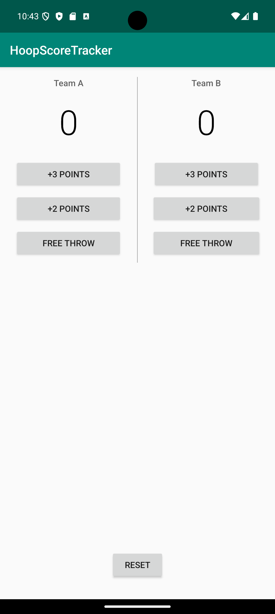
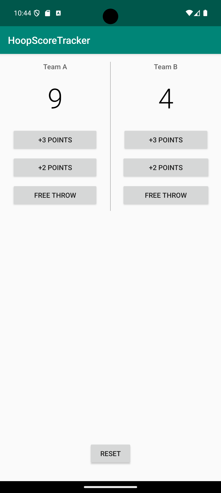

# HoopScoreTracker

<div align="center">


</div>

A simple and intuitive Android app for tracking basketball scores during games.

---

## Features

- **Dual Team Scoring**: Track scores for two teams simultaneously
- **Basketball Point System**: Support for 1-point, 2-point, and 3-point scoring
- **Real-time Updates**: Instant score display as points are added
- **Reset Functionality**: Quick reset to start a new game
- **Clean Interface**: Simple, easy-to-use design perfect for courtside scoring

---

## Screenshots

<div align="center">
  
  
</div>

*Screenshots showing the clean interface and real-time scoring functionality*

---

## Getting Started

### Prerequisites

- Android Studio Arctic Fox or later
- Android SDK API 21 (Android 5.0) or higher
- Java 8 or higher

### Installation

1. Clone the repository:
   ```bash
   git clone <repository-url>
   cd HoopScoreTracker
   ```

2. Open the project in Android Studio

3. Sync the project with Gradle files

4. Run the app on an emulator or physical device

### Building

To build the APK:

```bash
./gradlew assembleDebug
```

---

## Usage

1. **Adding Points**: Tap the +1, +2, or +3 buttons under each team to add points
2. **Viewing Scores**: Current scores are displayed prominently for both teams
3. **Resetting**: Use the reset button to start a new game with scores at 0-0

---

## Technical Details

- **Target SDK**: Android 14 (API 34)
- **Minimum SDK**: Android 5.0 (API 21)
- **Architecture**: Single Activity with traditional Android Views
- **Dependencies**: AndroidX libraries for modern Android development

---

## Project Structure

```
HoopScoreTracker/
├── app/src/main/
│   ├── java/com/example/android/courtcounter/
│   │   └── MainActivity.java           # Main scoring logic
│   ├── res/
│   │   ├── layout/
│   │   │   └── activity_main.xml       # UI layout
│   │   └── values/                     # Colors, strings, styles
│   └── AndroidManifest.xml
├── screenshots/                        # App screenshots
├── build.gradle                        # Project configuration
└── README.md
```

### Key Files
- **MainActivity.java**: Contains all basketball scoring logic and button handlers
- **activity_main.xml**: Split-screen UI layout for two teams
- **Resource files**: App colors, strings, and styling

---

## Contributing

1. Fork the repository
2. Create a feature branch (`git checkout -b feature/amazing-feature`)
3. Commit your changes (`git commit -m 'Add amazing feature'`)
4. Push to the branch (`git push origin feature/amazing-feature`)
5. Open a Pull Request

---

## License

This project is open source and available under the [MIT License](LICENSE).

---

## Acknowledgments

- Built as a learning project for Android development
- Inspired by the need for simple, reliable basketball scoring tools

---

## 👨‍💻 Author

**Sandesh S. Badwaik**

[](https://www.linkedin.com/in/sbadwaik/)
[](https://github.com/sbadwaik)

---

🌟 **If you found this project helpful, please give it a ⭐!**


